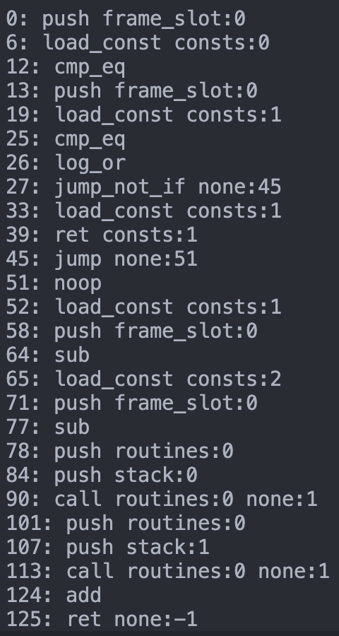

### XLang Virtual Machine

#### High-Level Overview
 - Stack based virtual architecture with stack(s).
    - Special registers:
        - **R_IP** 2 bytes
        - **R_ERR** 1 byte: (see error codes)
    - A N-peekable stack of operands
    - A "heap" for _aggregate_ objects i.e strings, tuples, and arrays
    - A call frame stack & instruction store
 - Contains a periodic, pausing GC

#### Instructions
 - **HALT**
 - **NOOP**
 - **PUSH** value-id
 - **POP** pop-n
 - **PEEK** base-offset
 - **LOAD_CONST** const-id
 - **MAKE_ARRAY** descending-temps-n
 - **MAKE_TUPLE** descending-temps-n
 - **ACCESS_FIELD** object-id, key-id
 - **NEGATE**
 - **ADD**
 - **SUB**
 - **MUL**
 - **DIV**
 - **CMP_EQ**
 - **CMP_NOT_EQ**
 - **CMP_GT**
 - **CMP_LT**
 - **LOG_AND**
 - **LOG_OR**
 - **JUMP** offset-id
 - **JUMP_IF** offset-id
 - **JUMP_NOT_IF** offset-id
 - **RET** result-location / result-id
    - Removes the stack frame's items on the stack until the temporary callee ref., and it then replaces it with the result. Then sets IP to the return address from the call frame.
 - **CALL** func-id, args-n
    - Places function ref. on the stack and creates a call frame with the return address (location in caller) and an arg-list of all pushed param. values.
 - **CALL_NATIVE** unit-id, func-id, args-n

#### Error Codes
 - **0** normal
 - **1** arithmetic error
 - **2** access error
 - **3** value stack error
 - **4** call stack error
 - **5** heap error
 - **6** memory exceeded error
 - **7** general error

### Bytecode Format:
 - Instruction:
   1. Arity prefix: 0, 1, 2, 3 (how many `Locator` arguments are present after the opcode)
   2. Opcode: 1 byte for a `VM::Opcode`.
   3. Arguments: An arity-prefix sized sequence of `Locator` arguments.

### Sample Bytecode Dump (Test 3b - Fibonacci)

